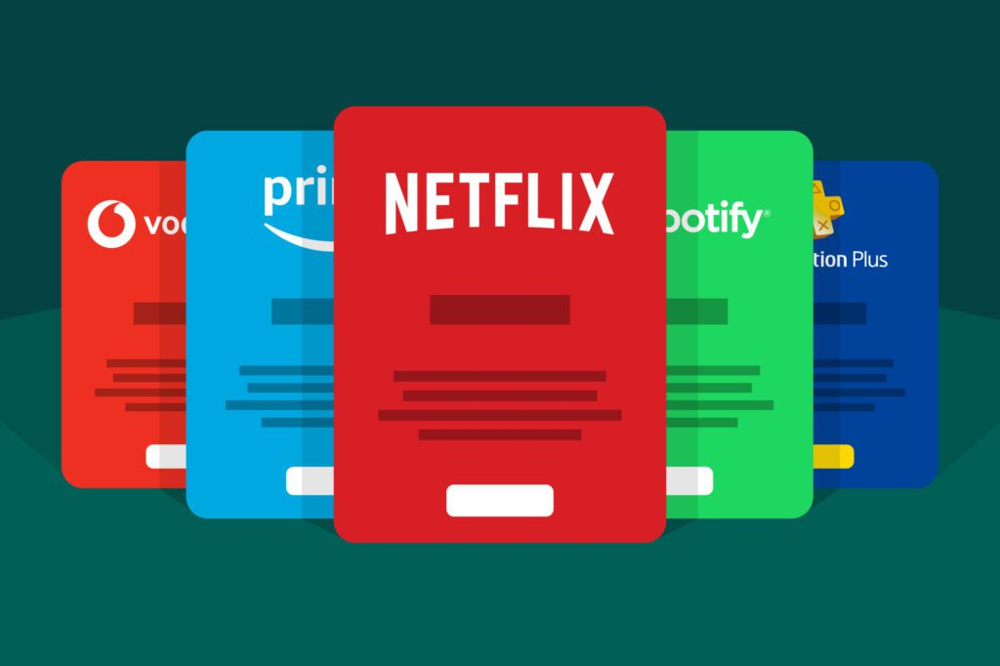

# Problema del modelo tecnologico 
## Software dependiente de subscripciones por servicio
---
Antes tú comprabas el servicio de un software de manera indefinida
Ahora debes estar pagando todos los meses por ese mismo servicio

# Solucion Sergio
Es cierto que ahora se espera que todo se pague por mensualidades o anualidades, incluso cuando antes era algo super basico
La solucion que he pensado en este caso es que en caso de que se usasen subscripciones, sea exclusivamente para ventajas realmente notables.
Una aplicacion con subscripcion tenga una version gratuita util, no excesivamente limitada, y que su version de "subscripcion" tenga ventajas mayores.
Vemos que recientemente las aplicaciones tienden a **recortar su version gratuita**, *achantando* para que paguemos su version premium, la cual es la que posee lo minimo para que la aplicacion sea comoda
Por si fuera poco generalmente las subscripciones cuestan alrededor de los 10 euros, lo cual parece poco, pero mes a mes, se empieza a hacer una carga economica innecesaria

###### En conclusion, sabiendo que dificilmente se pueden eliminar las subscripciones, y que las temporadas influyen en muchos ambitos, sería interesante que pagar para servicios basicos no sea una opcion, por lo tanto ampliar la version gratuita para que sea util, y mejorar las subcripsciones para que sean rentables, y no obligatorias

